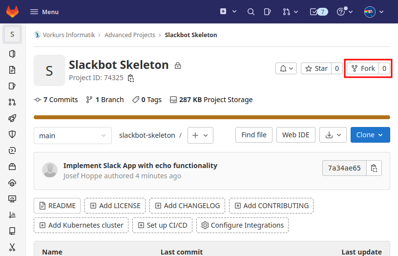

# Slackbot Skelett

**Wichtig: Meldet euch mit dem Namen des Bots auf slack bei _Josef (Crew)_**

Dieses Repository enthält das Skelett eines Slackbots für den Vorkurs Slack Workspace. Dieser gibt auf alle Nachrichten
genau die empfangene Nachricht als Antwort, sodass ihr sehen könnt, dass es funktioniert und wie man damit anfängt.

Ihr könnt es wie unten beschrieben forken, um eine Basis für euren eigenen Bot zu haben.

Euer Bot bekommt viele Rechte, in verschiedene Kanäle zu schreiben. Bitte spammt damit nicht, da das den Slack Workspace
für alle unbenutzbar macht und für mich nervig ist, da ich eurem Bot die Berechtigung wieder entziehen muss. Bedenkt
auch, dass euer Bot genau wie ihr keine unfreundlichen oder beleidigenden Nachrichten schreiben darf.

## Vorbereitung: Bot erstellen

Wendet euch an _Josef (Crew)_ auf Slack und schreibt den Namen eures Bots. Ihr bekommt einen Bot Token und einen App Token, die ihr eintragen könnt (siehe unten).

## Repository erstellen und erste Schritte

Da dieses Repository als Basis für alle verfügbar sein soll, müsst ihr euer eigenes erstellen. Am einfachsten geht das,
indem ihr die Fork Funktion von Gitlab benutzt. Klickt dazu auf den "Fork" Button (siehe Screenshot)

Wenn ihr geforkt habt, solltet ihr nun euer eigenes Repository haben, in dem ihr euch austoben könnt! Bevor ihr mit der
tatsächlichen Entwicklung anfangt, möchte ich euch noch etwas in das Projekt einführen. (Falls noch nicht geschehen,
solltet ihr das Repository jetzt clonen.)

### Build System

Das Projekt verwendet Gradle als Build System. IntelliJ bindet Gradle aber gut ein, sodass ihr euch vermutlich nicht
darum kümmern müsst. Solltet ihr aber eine weitere Bibliothek benötigen, muss diese in der `build.gradle` unter
`dependencies` eingefügt werden.

Falls ihr eine fertige `jar`-Datei erstellen wollt, könnt ihr einfach `./gradlew fatJar` im Hauptverzeichnis ausführen. Unter `build/libs/` findet ihr die "fat" jar, also eine ausführbare Datei mit allen benötigten Libraries.

### Entwicklung

Der Code befindet sich unter `src` im package `de.rwth.informatik.vorkurs.slackbot`. Dort seht ihr zwei Klassen:
`Configuration` und `Main`.

Öffnet nun `Configuration` und kopiert den Bot Token und App Token, die ihr erhalten habt, in die entsprechenden
Stringkonstanten. Diese werden von dem Programm benutzt, um sich Slack gegenüber zu identifizieren.

Zuletzt öffnet die `Main`. Ihr könnt das Programm starten, indem ihr links auf einen der beiden grünen Pfeile klickt.
Wenn ihr nun auf Slack eurem Bot eine Nachricht schickt, sollte dieser die Nachricht genau so zurückschicken.

Damit seid ihr soweit und könnt mit der Entwicklung eurer eigenen Features anfangen! Wenn ihr noch Fragen habt, benutzt
zuerst Google oder guckt [hier](https://slack.dev/java-slack-sdk/guides/bolt-basics) nach, wenn es um die Slack API geht.
Es gibt auf Slack auch den **#bot-talk** Channel, dem ihr beitreten könnt, um Ideen auszutauschen oder Fragen zu
fortgeschrittenen Themen zu stellen.

Wenn ihr ein Slashcommand (z.B. `/hallo`) hinzufügen möchtet, wendet euch bitte wieder an euren Tutor.
